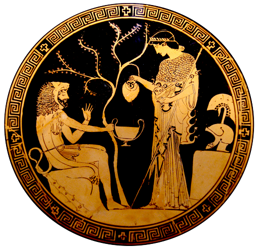

Heracles and Athena
===================

This work is licensed under a Creative Commons Attribution 3.0 Unported
License. See the file LICENSE.txt.

Based on this public domain image:
http://en.wikipedia.org/wiki/File:Athena_Herakles_Staatliche_Antikensammlungen_2648.jpg

Of Heracles and Athena. Tondo of an Attic red-figure kylix, 480–470 BC. From
Vulci. Python (potter) and Douris (painter).

